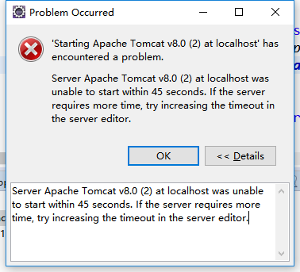
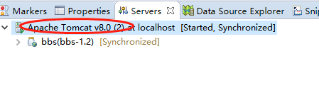
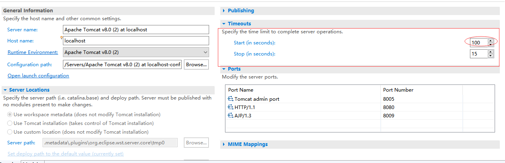

### 在eclipse中启动tomcat提示启动超时

##### 问题描述
在eclipse中部署完web项目后，启动tomcat8报如下错误：

##### 原因解释
1、tomcat服务器中有不同的项目，即webapp下包含不同的项目

2、项目过大，启动时间较长

3、项目配置文件配置项有问题

##### 解决办法
本人是第2条原因导致。
方法即将tomcat启动限制时间增大。

eclipse中设置如下：

1、打开tomcat配置项（双击）

2、设置启动限制时间

